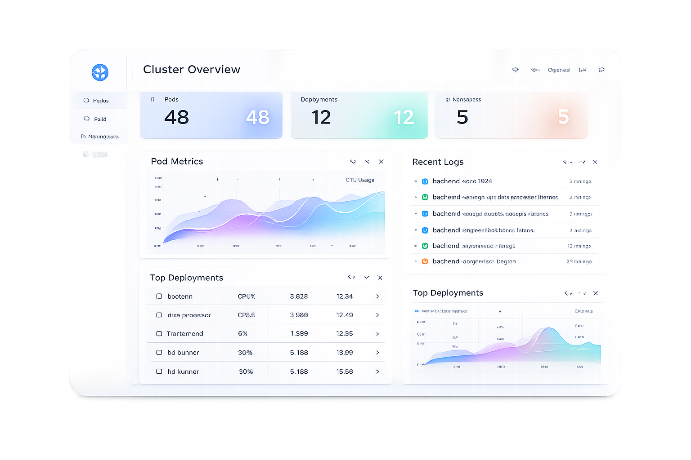

# KubeAssist — AI-Powered Kubernetes Operations Platform

<p align="center">
  
</p>

<p align="center">
  <strong>A production-grade web platform for monitoring, debugging, and operating Kubernetes clusters — with built-in AI assistance.</strong>
</p>

<p align="center">
  
  
  
  
  
  
</p>

---

## Overview

**KubeAssist** is a full-stack DevOps observability and operations platform that gives engineering teams a unified interface to monitor, debug, and manage Kubernetes workloads. It combines real-time cluster telemetry with AI-driven troubleshooting, making it practical for both platform engineers and application developers who need scoped, safe access to their slice of the cluster.

### Why KubeAssist?

Modern Kubernetes environments are complex. Developers waste hours context-switching between `kubectl`, Grafana dashboards, log aggregators, and runbooks. KubeAssist brings these workflows into a single, role-aware UI:

- **Admins** see the full cluster, manage teams, and control namespace access.
- **Developers** see only their team's namespaces — no noise, no accidental cross-team access.
- The **AI Assistant** understands natural language queries about pods, deployments, logs, and failures — and suggests remediation steps.

---

## Features

### Cluster Observability
- **Executive Dashboard** — Real-time workload health overview: deployments, jobs, CronJobs, DaemonSets, StatefulSets, and pods. CPU/Memory pie charts with deployment-level aggregation. Automatic 5-second refresh.
- **Workloads Explorer** — Tabbed view across all resource types with status filtering, namespace filtering, and free-text search.
- **Cluster Events** — Paginated, filterable event stream (Normal / Warning) with expandable full messages. Auto-refreshes every 15 seconds.
- **Nodes View** — Node inventory and status.

### Debugging & Operations
- **Structured Querying** — Three-tab interface:
  - *Troubleshooting* — Run `kubectl`-style commands safely inside a disposable debug pod (nicolaka/netshoot) in any namespace. Preset commands for common diagnostics. Cancelable long-running commands.
  - *Log Viewer* — Browse pod logs with container selection, tail-line control, previous-crash toggle, and in-page search.
  - *Metrics* — Container-level CPU/Memory usage from the Metrics Server, and service endpoint scraping via the debug pod.

### AI Assistant
- Natural-language query interface powered by **Groq (LLaMA 3.1-8B)**.
- Understands intent: list resources, describe, health checks, failure analysis.
- Context-aware: remembers the last identified issue so follow-up questions like *"how do I fix this?"* get specific remediation advice with exact `kubectl` commands.
- Namespace-scoped for developers (respects team access).
- Copyable suggestion commands.

### Access Control & Team Management
- **Role-based access**: `admin` and `developer` roles.
- **Teams** — Each team is assigned one or more Kubernetes namespaces. Developers only see workloads, events, logs, and metrics within their team's namespaces.
- **Admin Panel** — Full CRUD for teams and developers. Namespace assignment per team (multi-namespace). Searchable developer table with kebab-menu actions (edit, change team, remove, delete).
- **Team Detail Page** — Drill into a team: manage members, add/remove namespace assignments.

### Authentication
- Email + password login. Session stored in `localStorage`.
- Password reset via tokenised link (15-minute expiry).
- Profile photo upload (admin-configurable per user).

---

## Tech Stack

| Layer | Technology |
|---|---|
| Frontend | React 19, React Router 7, Tailwind CSS 3, Recharts, Lucide React, Framer Motion |
| Backend | Node.js, Express 5, Mongoose (MongoDB ODM) |
| Database | MongoDB |
| Kubernetes | `@kubernetes/client-node` (official JS client) |
| AI / LLM | Groq Cloud API — LLaMA 3.1-8B Instant |
| File Uploads | Multer |
| Dev Cluster | `kind` (Kubernetes-in-Docker) |

---

## Prerequisites

| Requirement | Version |
|---|---|
| Node.js | 18+ |
| npm | 9+ |
| MongoDB | Running instance (local or Atlas) |
| Kubernetes cluster | Any — `kind`, minikube, EKS, GKE, AKS |
| `kubectl` | Configured with valid `kubeconfig` |
| Groq API Key | Free tier available at [console.groq.com](https://console.groq.com) |

---

## Quick Start

### 1. Clone the repository

```bash
git clone https://github.com/your-org/kubeassist.git
cd kubeassist
```

### 2. Backend setup

```bash
cd backend
npm install
```

Create `backend/.env`:

```env
MONGO_URI=mongodb://localhost:27017/devops_assistant
GROQ_API_KEY=your_groq_api_key_here
```

Start the backend:

```bash
node index.js
# Server starts at http://localhost:5000
```

### 3. Frontend setup

```bash
cd frontend
npm install
npm start
# App opens at http://localhost:3000
```

### 4. Create the first admin user

Use a MongoDB client or the following one-time script to seed an admin:

```js
// run with: node seed-admin.js (from backend/)
const mongoose = require("mongoose");
require("dotenv").config();
const User = require("./models/User");

mongoose.connect(process.env.MONGO_URI).then(async () => {
  await User.create({ name: "Admin", email: "admin@example.com", password: "admin123", role: "admin" });
  console.log("Admin created"); process.exit();
});
```

Then log in at `http://localhost:3000/auth`.

---

## Local Kubernetes Cluster (kind)

If you do not have a cluster, spin one up with [kind](https://kind.sigs.k8s.io/):

```bash
# Install kind
# https://kind.sigs.k8s.io/docs/user/quick-start/#installation

kind create cluster --name kubeassist-dev
kubectl cluster-info --context kind-kubeassist-dev
```

### Enable Metrics Server (for CPU/Memory charts)

```bash
kubectl apply -f backend/metrics-server-patch.yaml
```

This deploys the Metrics Server with `--kubelet-insecure-tls` enabled for local environments.

---

## Environment Variables

| Variable | Required | Description |
|---|---|---|
| `MONGO_URI` | Yes | MongoDB connection string |
| `GROQ_API_KEY` | Yes | Groq Cloud API key for LLM features |

---

## Project Structure

```
kubeassist/
├── backend/                  # Express API server
│   ├── index.js              # App entry, K8s API routes
│   ├── config/db.js          # MongoDB connection
│   ├── controllers/          # Route handlers
│   ├── models/               # Mongoose schemas (User, Team)
│   ├── routes/               # Express routers
│   ├── services/             # AI service, Kube exec service
│   │   └── handlers/         # Per-resource AI response formatters
│   └── utils/
└── frontend/                 # React SPA
    └── src/
        ├── api/k8sApi.js     # API helper functions
        ├── components/       # Reusable UI components
        ├── pages/            # Page-level components (one per route)
        ├── routes/           # ProtectedRoute wrapper
        └── App.js            # Router configuration
```

---

## Screenshots

| Dashboard | Workloads | AI Assistant |
|---|---|---|
|  | *(Workloads tab)* | *(AI chat)* |

---

## Roadmap

- [ ] JWT-based authentication (replace dummy token)
- [ ] Persistent conversation history for AI Assistant
- [ ] Helm chart for deploying KubeAssist itself on Kubernetes
- [ ] Slack / webhook alert integration for unhealthy pod events
- [ ] Multi-cluster support
- [ ] RBAC integration with native Kubernetes service accounts
- [ ] Dark mode

---

## Contributing

Pull requests are welcome. For major changes, please open an issue first to discuss what you would like to change.

1. Fork the repository
2. Create your feature branch: `git checkout -b feature/my-feature`
3. Commit your changes: `git commit -m 'Add my feature'`
4. Push to the branch: `git push origin feature/my-feature`
5. Open a pull request

---

## License

MIT — see [LICENSE](LICENSE) for details.
